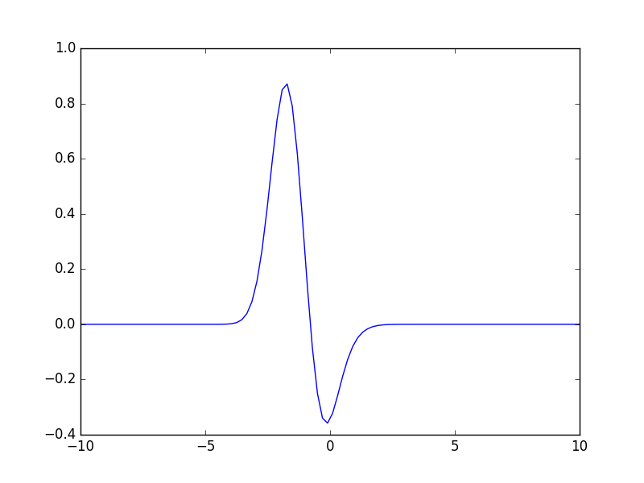

# Quantum Entanglement for Python
## Installation

This package can be installed using `pip`.

```
>>> pip install pyqentagnle
```

To use it, enter

```
>>> import pyqentangle
>>> import numpy as np
```

## Schmidt Decomposition for Discrete Bipartite States

We first express the bipartite state in terms of a tensor. For example, if the state is `|01>+|10>`, then express it as

```
>>> tensor = np.array([[0., np.sqrt(0.5)], [np.sqrt(0.5), 0.]])
```

To perform the Schmidt decompostion, just enter:

```
>>> pyqentangle.schmidt_decomposition(tensor)
[(0.5000000000000001, array([ 0.+0.j,  1.+0.j]), array([ 1.+0.j,  0.+0.j])),
 (0.5000000000000001, array([ 1.+0.j,  0.+0.j]), array([ 0.+0.j,  1.+0.j]))]
```

For each tuple in the returned list, the first element is the Schmidt coefficients, the second the component for first subsystem, and the third the component for the second subsystem.

## Schmidt Decomposition for Continuous Bipartite States

We can perform Schmidt decomposition on continuous systems too. For example, define the following normalized wavefunction:

```
>>> fcn = lambda x1, x2: np.exp(-((0.5*(x1+x2))**2))*np.exp(-(x1-x2)**2)*np.sqrt(2./np.pi)
```

Then perform the Schmidt decomposition, 

```
>>> decompositions = pyqentangle.continuous_schmidt_decomposition(fcn, -10., 10., -10., 10., keep=10)
```

where it describes the ranges of x1 and x2 respectively, and `keep=10` specifies only top 10 Schmidt modes are kept. Then we can read the Schmidt coefficients:

```
>>> map(lambda dec: dec[0], decompositions)
[0.88888888888888884,
 0.098765432098765565,
 0.010973936899862853,
 0.0012193263222069757,
 0.00013548070246744356,
 1.5053411385271871e-05,
 1.6726012650322333e-06,
 1.8584458500366187e-07,
 2.0649398326795657e-08,
 2.2943775912005789e-09]
```

The second and the third elements in each tuple in the list `decompositions` are lambda functions for the modes of susbsystems A and B respectively. The Schmidt functions can be plotted:
```
>>> x1array = np.linspace(-10., 10., 100)
>>> x2array = np.linspace(-10., 10., 100)
>>> import matplotlib.pyplot as plt
>>> plt.plot(x1array, decompositions[0][1](x1array))
>>> plt.plot(x2array, decompositions[0][1](x2array))
```




## Useful Links

* Github page: [https://github.com/stephenhky/pyqentangle](https://github.com/stephenhky/pyqentangle)
* PyPI page: [https://pypi.python.org/pypi/pyqentangle/](https://pypi.python.org/pypi/pyqentangle/)
* Documentation: [http://pyqentangle.readthedocs.io/](http://pyqentangle.readthedocs.io/)

## Reference
* Artur Ekert, Peter L. Knight, "Entangled quantum systems and the Schmidt decomposition", *Am. J. Phys.* 63, 415 (1995).